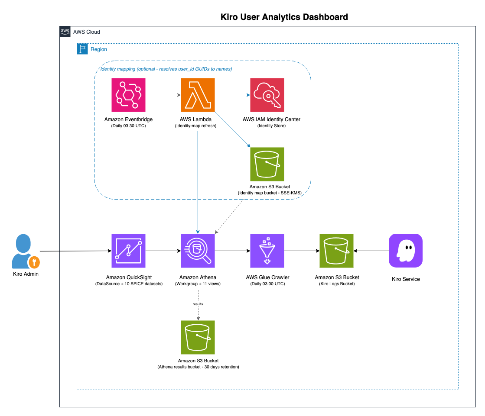
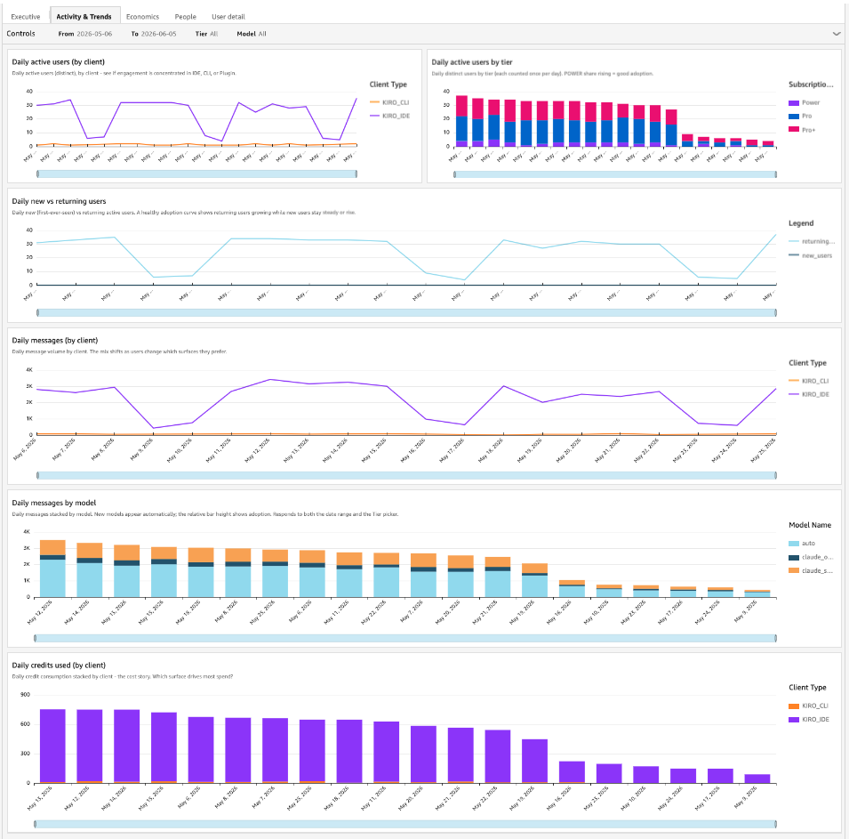
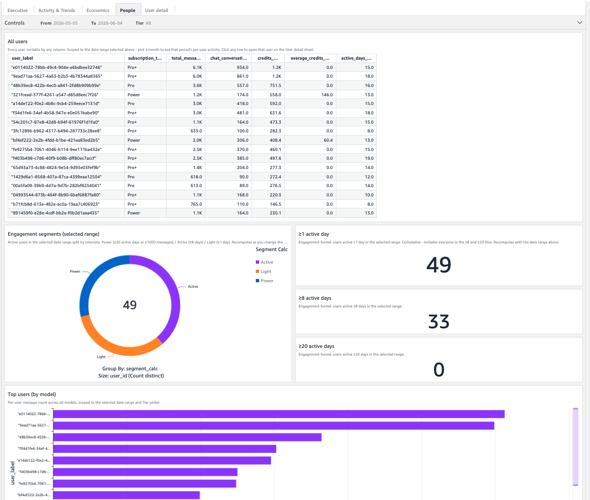
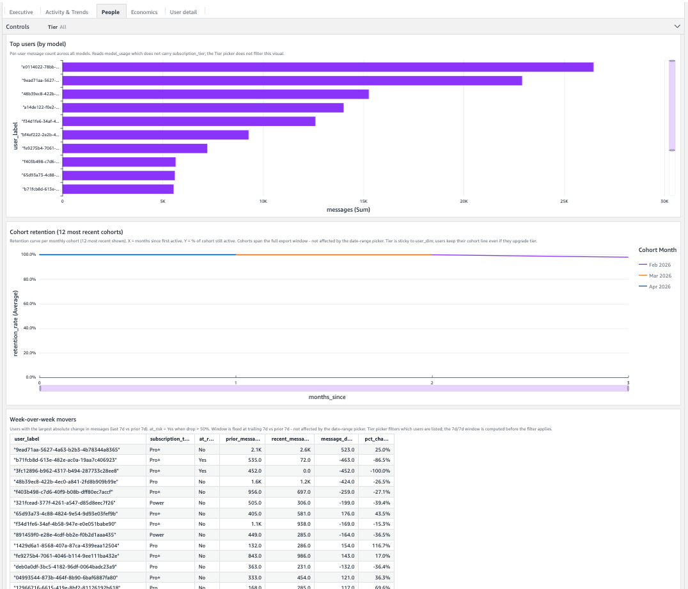
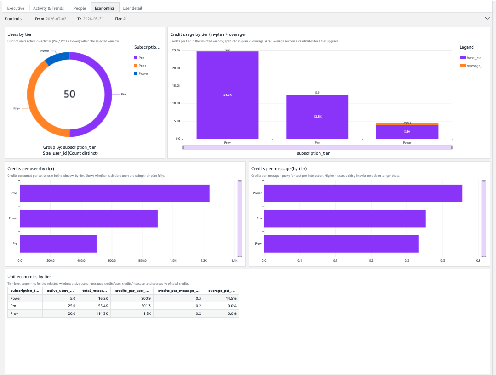
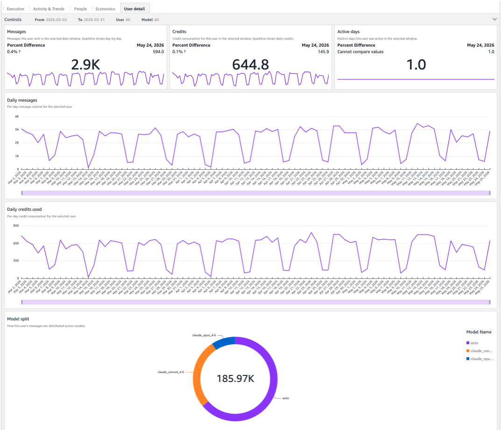

# Sample Kiro User Analytics Dashboard

A deployable Amazon QuickSight dashboard for the Kiro **User Activity Report** exported to Amazon S3. This solution gives Kiro administrators per-user analytics and engagement insights that the built-in Kiro dashboard does not surface.

## Overview

This dashboard answers questions about how Kiro is *used*:

* Which users are most active, and how does that change week-over-week?
* Which models are users actually picking (`auto`, `claude-sonnet-4-6`, etc.)?
* What does the engagement funnel (users active >=1 / >=8 / >=20 days in the selected period) look like?
* Which users dropped >50% in messaging volume and may be at risk of churning?
* What does credit consumption look like by tier, and where is overage concentrated?

For Kiro **cost and seat utilization** questions (per-user spend, idle seats, billing roll-ups), use the Kiro module in the [Cloud Intelligence Dashboards (CUDOS)](https://github.com/aws-solutions-library-samples/cloud-intelligence-dashboards-framework). Deploy both side-by-side for the full picture.

> **Note:** This solution targets the **modern Kiro User Activity Report** export. The legacy `by_user_analytic` report (from Amazon Q Developer) is not supported - Amazon Q Developer reaches end-of-support per the [AWS announcement](https://aws.amazon.com/blogs/devops/amazon-q-developer-end-of-support-announcement/), and this dashboard is built only on the supported `user_report` schema.

## Architecture diagram



Kiro writes a daily user activity report to a customer-owned Amazon S3 bucket. An AWS Lambda function reads those CSVs by header and writes a fixed-schema normalized copy (a stable "facts" dataset plus a long-form per-model "messages" dataset), partitioned by export date, back to the results bucket; Amazon Athena partitioned external tables plus dedup views curate that normalized data. Amazon QuickSight datasets import the curated views into SPICE and refresh daily. The published dashboard exposes four sheets - Activity & Trends, Economics, People, and User detail - with model, tier, and date-range pickers across the sheets.

Reading the raw report by header (rather than crawling it into a positional table) is deliberate: the report's columns drift over time - Kiro adds a new `<model>_messages` column whenever it launches a model, and the trailing `New_User` column is present in some exports and not others - so a positional table misattributes per-model usage and corrupts `new_user`. The normalizer keys every value by its header name, which is immune to that drift.

## Dashboard preview

### Activity & Trends



### People





### Economics



### User detail



## Reading the dashboard: date-window behavior

Most visuals respond to the date-range picker, but one uses a **fixed window** by design (the week-over-week movers comparison only makes sense against a fixed reference). Fixed-window visuals carry their window in the title (e.g. "(fixed 7d vs 7d)"). The date picker has no effect on them.

| Visual | Sheet | Window |
|--------|-------|--------|
| All Activity & Trends visuals | Activity & Trends | Date picker |
| All Economics visuals | Economics | Date picker |
| All users table | People | Date picker |
| Engagement segments donut | People | Date picker |
| Engagement funnel tiles (≥1 / ≥8 / ≥20) | People | Date picker |
| Top users (by model) | People | Date picker |
| Week-over-week movers | People | **Fixed** trailing 7d vs prior 7d |
| All User detail visuals | User detail | Date picker (+ user selection) |

> **Note on the default range:** the date picker defaults to the **last 30 days**. The week-over-week movers table uses its own fixed 7d-vs-7d window regardless. For a wider default, change the `RollingDate` expression for `DateRangeStart` in `scripts/create_dashboard.py` from `addDateTime(-30, 'DD', ...)` to e.g. `addDateTime(-90, 'DD', ...)`; users can always widen the range with the picker.

## Getting started

### Pre-requisites

* An [AWS account](https://aws.amazon.com/account/) with permissions to deploy AWS CloudFormation stacks and create the resources used by this solution: AWS Glue (database), Amazon Athena (workgroup), AWS Lambda (the report normalizer + IAM role) and Amazon EventBridge (its daily schedule), Amazon S3 (one results bucket), and Amazon QuickSight (data source, datasets, refresh schedules, analysis, dashboard). Administrator access is sufficient but not required - the equivalent service permissions work.
* The Kiro **User Activity Report** export to Amazon S3 enabled by a Kiro administrator. See the [Kiro user activity report documentation](https://kiro.dev/docs/enterprise/monitor-and-track/user-activity/).
* **Amazon QuickSight Enterprise edition** active in the same AWS Region as the Amazon S3 bucket. The Athena data source cannot cross AWS Regions.
* Amazon Athena enabled in QuickSight (QuickSight -> Manage account -> Permissions -> AWS resources -> check **Athena**). The deploy script does not toggle this for you - Amazon QuickSight requires the toggle to be set via the console. The same screen also asks you to select Amazon S3 buckets; leave the S3 selection empty (the deploy script handles S3 access separately, see the next bullet). When you click Save, QuickSight should attach the `AWSQuicksightAthenaAccess` managed policy to the QuickSight service role - in some accounts this attachment silently fails. The deploy script verifies the policy is attached and offers to attach it for you if it is not.
* Amazon S3 access for Amazon QuickSight does **not** need to be pre-configured via the console. The deploy script grants S3 access automatically by attaching an inline IAM policy (`KiroAnalyticsQuickSightS3Access`) to the QuickSight service role. Read on the Kiro logs bucket, read + write on the Athena results bucket (Athena queries run by QuickSight write their results there). The console-managed `AWSQuickSightS3Policy` is left untouched, so the QuickSight console keeps full ownership of it - this avoids the *"This policy was modified outside of QuickSight"* warning that appears when the console-managed policy is edited by another tool. See [QuickSight permission errors](https://repost.aws/knowledge-center/quicksight-permission-errors) and [Athena output bucket error](https://repost.aws/knowledge-center/athena-output-bucket-error) for background.
* AWS CLI v2, Python 3.10 or later, and the `boto3` Python package (install with `python3 -m pip install 'boto3>=1.34'` if not already present).
* A Unix-style shell to run the deployment scripts: macOS, Linux, Windows Subsystem for Linux (WSL), Git Bash on Windows, or AWS CloudShell. Native Windows PowerShell and `cmd.exe` are not supported - use AWS CloudShell from the AWS Console as the simplest option (bash, AWS CLI v2, Python 3, and `boto3` are pre-installed).

### Deployment

1. Clone the repository.

   ```bash
   git clone https://github.com/aws-samples/sample-kiro-user-analytics-quicksight-dashboard.git
   cd sample-kiro-user-analytics-quicksight-dashboard
   ```

2. Set the required environment variables.

   ```bash
   export KIRO_LOGS_BUCKET=<your-bucket>
   export QS_PRINCIPAL_ARN=arn:aws:quicksight:<region>:<account>:user/default/<name>
   export AWS_REGION=us-east-1
   export KIRO_LOGS_PREFIX="usage-activity/"
   ```

   * **`KIRO_LOGS_BUCKET`** - bucket name, ARN, or `s3://` URI all work. The script normalizes them.

   * **`QS_PRINCIPAL_ARN`** - the Amazon QuickSight user (or group) that should own the dashboard. To find it, run:

     ```bash
     aws quicksight list-users \
         --aws-account-id "$(aws sts get-caller-identity --query Account --output text)" \
         --namespace default \
         --region "${AWS_REGION:-us-east-1}" \
         --query 'UserList[].[UserName,Arn]' \
         --output table
     ```

     For users signed in via AWS IAM Identity Center or SSO the `UserName` may contain a slash (e.g. `Admin/sso-session`); copy the ARN from this command verbatim rather than constructing it by hand.

   * **`AWS_REGION`** - the Amazon QuickSight home region; it must match the AWS Region of the Kiro logs bucket. The Amazon Athena data source created by the QuickSight stack cannot cross regions.

   * **`KIRO_LOGS_PREFIX`** - the path inside `KIRO_LOGS_BUCKET` above `AWSLogs/<account-id>/KiroLogs/user_report/`. **Setting it explicitly is strongly recommended.** If unset, the deploy and preflight scripts run `aws s3 ls --recursive` to auto-detect it, which paginates through every key in the bucket. On large buckets that hold other content (Amazon Q logs, other AWS service logs, prompt logs from another product) this can take many minutes and incurs a per-1000-keys Amazon S3 LIST charge. To find the right value, list the bucket non-recursively:

     ```bash
     aws s3 ls "s3://${KIRO_LOGS_BUCKET}/" --region "${AWS_REGION}"
     ```

     The directory immediately above `AWSLogs/` is the prefix. For example, if Kiro writes to `s3://my-bucket/usage-activity/AWSLogs/<account>/KiroLogs/user_report/...`, set `KIRO_LOGS_PREFIX="usage-activity/"`. If Kiro writes to the bucket root, set `KIRO_LOGS_PREFIX=""`.

   Optional environment variables:

   * **HASH_EMAILS** (default `false`): SHA-256 emails at the view layer so plaintext does not reach SPICE.
   * **KMS_KEY_ARN** (default empty): AWS Key Management Service (AWS KMS) key ARN that encrypts the Kiro logs bucket. The report-normalizer Lambda role is granted `kms:Decrypt` on this key.
   * **STACK_PREFIX** (default `kiro-analytics`): Prefix for the two AWS CloudFormation stacks.
   * **QS_IAM_ROLE_NAME** (default `aws-quicksight-service-role-v0`): The IAM role QuickSight uses to access AWS resources. Change this if your QS account is configured under QuickSight -> Manage account -> Permissions -> IAM role -> "Use an existing role" - set it to the name of that existing role. The deploy script confirms the role with you before writing to it.
   * **THEME_MODE** (default `light`): Set to `dark` for a dark-mode dashboard. The Kiro purple categorical palette is the same in both modes; only the background and text colors flip.
   * **IDENTITY_MAPPING** (default `false`): Resolve the report's opaque `user_id` GUIDs to human names via AWS IAM Identity Center. Opt-in; see [Resolving user identities](#resolving-user-identities-optional) below. On an interactive deploy you are prompted `y/N` if this is unset. Mutually exclusive with `HASH_EMAILS`.
   * **IDENTITY_STORE_ID** (required when `IDENTITY_MAPPING=true`): The Identity Store id, which **starts with `d-`** (e.g. `d-1234567890`). This is *not* the Identity Center instance ARN or `ssoins-` instance id. Find it on the IAM Identity Center **Settings** page, or run `aws sso-admin list-instances --query 'Instances[].IdentityStoreId'`. The deploy script rejects an instance ARN / `ssoins-` value with a pointer to the right one.
   * **IDC_REGION** (default `AWS_REGION`): The AWS Region IAM Identity Center lives in. It can differ from the dashboard region (for example, Identity Center in `eu-west-1` while the data and dashboard are in `us-east-1`).
   * **IDC_ROLE_ARN** (default empty): Optional. ARN of a role to assume when IAM Identity Center lives in a different AWS account (the organization management or a delegated-admin account). Leave empty for same-account Identity Center.
   * **IDENTITY_MAP_REFRESH_SCHEDULE** (default `cron(30 3 * * ? *)`): EventBridge schedule for the daily identity-map refresh (03:30 UTC, after the 03:15 report normalizer and before the 04:00 SPICE refresh).

3. Run the preflight check.

   ```bash
   scripts/preflight.sh
   ```

   The script verifies that the prerequisites are met and exits non-zero if any blocker is found.

4. Deploy the solution.

   ```bash
   scripts/deploy.sh
   ```

   The deploy script creates two AWS CloudFormation stacks (data layer and QuickSight layer), invokes the report-normalizer Lambda, builds Amazon Athena external tables and views, attaches an inline IAM policy to the QuickSight service role for S3 access, and creates the QuickSight Analysis and Dashboard. End-to-end runtime is approximately five minutes.

   On a brand-new account, the deploy needs to write an inline IAM policy granting QuickSight access to the two S3 buckets it uses. The behavior depends on how you invoke the script:

   * **Interactive shell** (TTY): the script prints what it's going to write, asks for confirmation, and continues if you answer `y`.
   * **Non-interactive shell** (CI, piped stdin, `bash -c`, `yes |`, etc.): the script prints the exact `grant_quicksight_s3.py --apply` command, exits 1, and you re-run `scripts/deploy.sh` after applying.
   * **Skip the prompt with `AUTO_APPROVE_IAM=true`**: applies the policy without asking. Use in CI where you've already reviewed the change.

   The dashboard URL is printed at the end of the run.

### Testing the deployment

Open the printed dashboard URL. The first SPICE refresh runs automatically when the datasets are created; subsequent refreshes happen daily at 04:00 UTC.

To trigger an immediate refresh of all datasets:

```bash
ACCOUNT_ID="$(aws sts get-caller-identity --query Account --output text)"
for ds_full in $(aws cloudformation list-stack-resources \
                   --stack-name kiro-analytics-qs \
                   --region "$AWS_REGION" \
                   --query 'StackResourceSummaries[?ResourceType==`AWS::QuickSight::DataSet`].PhysicalResourceId' \
                   --output text); do
  ds="${ds_full##*|}"   # strip the "<account>|" prefix
  aws quicksight create-ingestion \
      --aws-account-id "$ACCOUNT_ID" \
      --data-set-id "$ds" \
      --ingestion-id "manual$(date +%s)" \
      --region "$AWS_REGION" \
      --query 'IngestionStatus' --output text || true
  sleep 1
done
```

Confirm the dashboard reached a terminal-successful state:

```bash
aws quicksight describe-dashboard \
    --aws-account-id "$(aws sts get-caller-identity --query Account --output text)" \
    --dashboard-id kiro-analytics \
    --region "$AWS_REGION" \
    --query 'Dashboard.Version.Status' --output text
# Expected output: CREATION_SUCCESSFUL
```

The four sheets:

* **Activity & Trends**: Laid out cost → adoption → engagement → model detail. A stacked credits-by-client bar leads as the cost story; an adoption group pairs daily active users by client (clustered) and by tier (stacked) with a narrow new-vs-returning tile; daily messages by client (stacked); and a full-width 100%-stacked "message mix by model" bar showing each model's share of daily messages. All time-series are bars rather than lines so days with no activity read as gaps, not interpolated usage. Active-users-by-client is clustered (distinct users can't be summed across clients); message/credit splits stack cleanly. Date-range, tier, and model pickers (the Tier picker now also filters the model visuals).
* **Economics**: Users by tier, credit usage by tier (in-plan + overage), credits per user and per message, and a unit-economics table - all scoped to the selected window. Date-range and tier pickers.
* **People**: Sortable All Users table (one row per user - usage is summed across the selected period even if the user changed tier, with the tier column showing their most-recent tier), engagement segments donut, engagement funnel tiles (≥1 / ≥8 / ≥20 active days), top users by model, and a week-over-week movers table with at-risk flag. Click a row in the All Users table to drill into that user on the User detail sheet. Date-range and Tier pickers - the All Users table, engagement-segments donut, funnel tiles, and top-users-by-model are scoped to the selected range, so you can pick a month (e.g. usage that resets on the 1st) and see that period's activity; the week-over-week movers table keeps its own trailing-window logic.
* **User detail**: Single-user drill-down. A lifetime profile strip at the top identifies the user (name/email when identity mapping is on, else the user ID) with plan tier, first/last active date, and lifetime totals - not date-filtered. Below it, the total messages, credits, and active days for the selected window, plus daily message/credit bars (which show no-activity days as gaps, not skipped) and a model split. Pick a user from the dropdown or arrive via the People click-through. Date-range and model pickers. (Because the profile is lifetime, the sheet still shows who the user is even if they had no activity in the selected window.)

## How it works

The solution is layered:

1. **Data layer** (`cfn/01-data-layer.yaml`): An AWS Glue database, an Amazon Athena workgroup, an Amazon S3 results bucket, and a **report-normalizer AWS Lambda** (`scripts/normalize_report_lambda.py`). The Lambda reads the raw Kiro CSVs by header and writes fixed-schema output to the results bucket, partitioned by export date: `normalized/facts/export_date=YYYY-MM-DD/` (stable scalar columns, one row per date/user/client) and `normalized/models/export_date=YYYY-MM-DD/` (long form, one row per date/user/client/model/messages). It runs daily at 03:15 UTC, after Kiro's 02:00 UTC export. The Lambda is **streaming and incremental**: it processes one file at a time (so memory is flat regardless of seat count or history depth) and skips files it has already normalized (keyed on the source object + ETag, so a re-exported file is reprocessed automatically). This scales to large fleets - it has been validated at 300 users / 120 days, and steady-state daily runs touch only the new file.

2. **Curated views** (`athena/*.sql`): `scripts/build_views.py` registers two **partitioned** Amazon Athena external tables (`report_facts_raw`, `report_models_raw`) over the normalized parts, using **partition projection** on `export_date` so no partition registration (`MSCK`/`ADD PARTITION`) is ever needed. On top of those it creates two dedup **views** (`report_facts`, `report_models`) that keep only the latest export per date/user/client via `ROW_NUMBER()` (latest-export-wins) - so deduplication happens in SQL at query time, which scales to any history size while the header parsing stays in the Lambda. `base_user_activity` and `user_dim` read `report_facts`; `model_usage` is a straight projection of the long-form `report_models` (no model unpivot needed - the Lambda already melted the per-model columns into rows, so new Kiro models add rows, never columns). Other views compute daily trends (including new vs returning users), per-user totals (incl. a gap-filled per-user daily series for the User-detail charts), tier breakdowns, engagement segmentation, an activity heatmap, and week-over-week movers. (The People-sheet engagement funnel is computed in QuickSight from the base view rather than as its own Athena view, so it responds to the date range.)

3. **QuickSight DataSource and DataSets** (`cfn/02-quicksight.yaml`): One Amazon Athena DataSource and 10 SPICE datasets, each with a daily 04:00 UTC refresh schedule.

4. **Analysis and Dashboard** (`scripts/create_dashboard.py`): The Analysis and Dashboard are created via `boto3`. Assembling the QuickSight Definition payload as a Python dictionary keeps the visual configuration easy to edit and review. The script polls until the asset reaches a terminal state and exits non-zero on failure.

5. **Identity mapping** (`cfn/03-identity-mapping.yaml`, optional): Created only when `IDENTITY_MAPPING=true`. A Lambda resolves user GUIDs to names via AWS IAM Identity Center and lands a lookup CSV in a dedicated encrypted bucket that the curated views join. See [Resolving user identities](#resolving-user-identities-optional).

## Customization options

* **Hash emails before they reach SPICE**: Set `HASH_EMAILS=true`. The base view replaces `email` with `to_hex(sha256(email))`. The user labels in tables and the User detail drill-down show opaque digests instead of plaintext.

* **Encrypted Kiro logs bucket**: Set `KMS_KEY_ARN=arn:aws:kms:...`. The normalizer Lambda's IAM role is granted `kms:Decrypt` on the key. The KMS key policy must permit the normalizer role:

   ```json
   {
     "Sid": "Allow Kiro report normalizer",
     "Effect": "Allow",
     "Principal": { "AWS": "arn:aws:iam::<account>:role/<stack-prefix>-data-NormalizerLambdaRole-XXXX" },
     "Action": ["kms:Decrypt"],
     "Resource": "*"
   }
   ```

* **Kiro adds a new model**: No action needed. Because the normalizer melts per-model columns into rows keyed by header name, a new `<model>_messages` column is picked up automatically on the Lambda's next daily run and appears as a new `model_name` value - no schema change, no re-deploy. (Re-run `scripts/deploy.sh` only if you want it reflected immediately rather than at the next scheduled run.)

* **Row-level security**: Not configured by default. Add a QuickSight RLS dataset rule keyed on `subscription_tier`, `user_id`, or another column to scope visuals per viewer.

* **Resolve user IDs to human names**: Set `IDENTITY_MAPPING=true` (and the `IDENTITY_STORE_ID` / `IDC_REGION` inputs). See [Resolving user identities](#resolving-user-identities-optional) below.

### Resolving user identities (optional)

> **⚠️ IMPORTANT — personal data:** Enabling identity mapping pulls real names and email addresses (personal data) into Amazon QuickSight SPICE. If your IAM Identity Center is in a different AWS Region than the dashboard, this performs a **cross-region transfer of personal data**. Review [SECURITY.md](./SECURITY.md#identity-mapping-optional) and confirm this is acceptable under your GDPR, data-residency, and privacy obligations **before** enabling.

The Kiro User Activity Report identifies each user by an opaque `user_id` GUID, and the `email` column is often empty in real exports. By default the dashboard therefore labels users by their GUID. If your users sign in through **AWS IAM Identity Center**, you can opt in to resolving those GUIDs to human names (display name, username, email).

```bash
export IDENTITY_MAPPING=true
export IDENTITY_STORE_ID=d-xxxxxxxxxx     # starts with d- (see below)
export IDC_REGION=eu-west-1               # region Identity Center lives in
# export IDC_ROLE_ARN=arn:aws:iam::<mgmt-account>:role/...   # only if cross-account
scripts/deploy.sh
```

**How it works.** When enabled, the deploy adds a third CloudFormation stack (`<prefix>-identity-map`, from `cfn/03-identity-mapping.yaml`) containing:

* a small **Lambda** that lists the active users from the activity data, looks them up in your Identity Store with `identitystore:ListUsers`, and writes a `user_id -> name` CSV to a **dedicated, SSE-KMS-encrypted S3 bucket** (separate from the rest of the solution's data);
* an **EventBridge** daily schedule that refreshes that CSV (so new hires and leavers stay current);
* an **Athena external table** (`identity_map`) that the curated views `LEFT JOIN`, so `user_label` resolves to `display_name -> email -> username -> user_id` (falling back to the GUID for anyone not in the directory).

The deploy invokes the Lambda **synchronously** before building the views, so real names appear on the **first** dashboard open - there is no 24-hour wait. The daily schedule only keeps the map fresh afterward.

**Finding your Identity Store ID.** It starts with `d-` and is shown on the IAM Identity Center **Settings** page. It is *not* the instance ARN or the `ssoins-...` instance id (those are for a different set of APIs this solution does not use). From the CLI:

```bash
aws sso-admin list-instances --query 'Instances[].IdentityStoreId' --output text
```

**Important constraints.**

* This pulls real names and email addresses into Amazon QuickSight SPICE. Review [SECURITY.md](./SECURITY.md#identity-mapping-optional) before enabling, especially if Identity Center is in a different AWS Region (a cross-region transfer of personal data).
* Only users who sign in via **IAM Identity Center** resolve. Users on an **external identity provider** (Okta, Entra, etc.), **AWS Builder ID**, or **social login** are not in the Identity Store and keep their GUID label.
* `IDENTITY_MAPPING` and `HASH_EMAILS` are mutually exclusive - resolving users to real names while hashing their email is contradictory, and the deploy script refuses to run with both set.

**Turning it off.** Re-run `scripts/deploy.sh` with `IDENTITY_MAPPING=false` (the default). The deploy rebuilds the views without the join, forces a SPICE refresh so resolved names are flushed from memory, empties and deletes the identity-map bucket, and removes the `<prefix>-identity-map` stack. (Its KMS key is retained - see Cleaning up.)

## Troubleshooting

* **`scripts/preflight.sh` or `scripts/deploy.sh` hangs at the Kiro export layout / prefix detection step**: the script is running `aws s3 ls --recursive` to auto-detect `KIRO_LOGS_PREFIX`. On large buckets that hold other content (Amazon Q logs, other AWS service logs, prompt logs from another product) this can take many minutes and incurs an S3 LIST charge per 1000 keys scanned. Interrupt with Ctrl-C, find the prefix non-recursively (`aws s3 ls "s3://${KIRO_LOGS_BUCKET}/" --region "${AWS_REGION}"`), set `KIRO_LOGS_PREFIX` explicitly (e.g. `export KIRO_LOGS_PREFIX="usage-activity/"`), and re-run.
* **`AthenaDataSource` fails with "Unable to verify/create output bucket"**: QuickSight does not have write access to the Athena results bucket. Re-run `scripts/deploy.sh` - the permission check will detect missing actions and offer to apply them. See [QuickSight permission errors](https://repost.aws/knowledge-center/quicksight-permission-errors) and [Athena output bucket error](https://repost.aws/knowledge-center/athena-output-bucket-error) for background.
* **`scripts/deploy.sh` reports a stack is in `ROLLBACK_COMPLETE`**: the script will detect and delete the rolled-back QuickSight stack automatically before re-deploying. If the data stack is stuck, run `scripts/teardown.sh` and start fresh.
* **The report-normalizer Lambda fails or the dashboard is empty**: check the Lambda's CloudWatch logs (`/aws/lambda/<stack-prefix>-data-normalize-report`). The most common cause is that its IAM role cannot read the Kiro logs bucket - verify the bucket policy and (for KMS-encrypted buckets) the KMS key policy, and set `KMS_KEY_ARN` before re-deploying if encryption is in play. The Lambda fails closed (leaves the previous normalized output in place), so a transient failure does not blank the dashboard.
* **Identity mapping is on but the dashboard still shows GUIDs**: the synchronous Lambda invoke at deploy time failed (the deploy prints a warning and continues - an identity-map failure never blocks the dashboard). Common causes: the `IDENTITY_STORE_ID` is wrong (it must start with `d-`), the deploy credentials lack `identitystore:ListUsers` in `IDC_REGION`, or (for cross-account Identity Center) `IDC_ROLE_ARN` is unset or its trust policy does not permit the Lambda role. Check the Lambda's CloudWatch logs (`/aws/lambda/<prefix>-identity-map`), fix the cause, and re-run `scripts/deploy.sh`. Users on an external IdP / Builder ID / social login keep their GUID by design.

## Cleaning up

```bash
scripts/teardown.sh
```

The teardown script deletes the QuickSight Dashboard, Analysis, both AWS CloudFormation stacks, and the Amazon Athena results bucket. The Kiro logs bucket and its contents are not modified. The script is idempotent and is safe to re-run.

If identity mapping was enabled, teardown also removes the `<prefix>-identity-map` stack and **empties and deletes its dedicated PII bucket** (and the bucket's access-log bucket), purging all object versions so no resolved names survive. The bucket's **AWS KMS key is retained** (it has `DeletionPolicy: Retain`, the safe default for a CMK) - it is not billed beyond the key itself. To remove it, schedule its deletion manually:

```bash
aws kms schedule-key-deletion \
    --key-id "$(aws kms describe-key --key-id alias/kiro-analytics-identity-map \
                  --query KeyMetadata.KeyId --output text)" \
    --pending-window-in-days 7 --region "$AWS_REGION"
```

## Known limitations

The first two items below describe security defaults the customer can choose
to change. Refer to [SECURITY.md](./SECURITY.md) for the full shared
responsibility model.

* **Email is ingested into SPICE in plaintext** unless `HASH_EMAILS=true` is set at deploy time. Customer responsibility: decide whether plaintext email is acceptable for the dashboard's audience based on data classification, and re-deploy with `HASH_EMAILS=true` if not.
* **Row-Level Security (RLS) is not configured.** Any principal with `quicksight:QueryDashboard` permission sees every user's data. Customer responsibility: configure dashboard permissions in Amazon QuickSight, and add an RLS dataset rule keyed on `subscription_tier` / `user_id` / etc. if per-row scoping is required (see Customization options).
* **User identities are shown as opaque GUIDs** unless `IDENTITY_MAPPING=true` is set and the users sign in via AWS IAM Identity Center. Customer responsibility: decide whether resolving GUIDs to real names (which pulls personal data into SPICE, possibly across regions) is appropriate for the dashboard's audience. See [Resolving user identities](#resolving-user-identities-optional) and [SECURITY.md](./SECURITY.md#identity-mapping-optional).
* Pre-April 2026 exports lack the `email` column and per-model `_messages` columns. The build script tolerates their absence; the affected visuals show user IDs or remain empty.
* Multiple Amazon S3 exports for the same `(user_id, date, client)` are deduped by keeping the most-recent export (the normalizer Lambda stamps each row with its source export, and an Athena view keeps the latest via `ROW_NUMBER()`).
* **Tier and credits reflect observed *usage*, not a billing/entitlement feed.** Every value (including `subscription_tier`) comes from the Kiro User Activity Report, which records what a user actually did each day. A user's tier is taken from their **most recent** day of activity, so an upgrade (e.g. Pro+ → Power) shows once they next use Kiro - but a user who hasn't used Kiro since changing plans will still show their last-observed tier until their next day of activity is exported. This is expected: the dashboard is a usage analytic. For authoritative current subscription status, use Kiro's own admin/billing tools.
* **The User-detail KPI tiles show the TOTAL for the selected date range** (messages, credits, active days summed over the whole window) - not a single day. To see day-by-day movement, use the daily bars below them or the Activity & Trends sheet.

## Encryption at rest

| Data store | Encryption | Configured by |
|------------|------------|---------------|
| Kiro logs Amazon S3 bucket (source) | Customer-managed. Set SSE-S3 or SSE-KMS on the bucket; pass the KMS key ARN via `KMS_KEY_ARN` so the report-normalizer Lambda is granted `kms:Decrypt`. | Customer |
| Athena results Amazon S3 bucket | SSE-S3 (`AES256`) by default, plus a TLS-only bucket policy. Versioning enabled. Lifecycle: `query-results/` expires after 30 days; `normalized/` (the dashboard's source data) is retained. Server access logging is opt-in (CloudTrail covers Athena API events at the account level). | This stack |
| Amazon Athena query results | `EncryptionConfiguration: SSE_S3` enforced by `EnforceWorkGroupConfiguration: true` on the workgroup. | This stack |
| Identity-map Amazon S3 bucket (only when `IDENTITY_MAPPING=true`) | SSE-KMS with a dedicated customer-managed key (rotation enabled), plus server access logging, versioning, a TLS-only bucket policy, and a 30-day noncurrent-version lifecycle. Holds resolved names/emails (PII), isolated from the rest of the solution's data. | This stack |
| Amazon QuickSight SPICE | Encrypted at rest with service-managed keys. There is no CFN property to configure SPICE encryption; it is on by default for Enterprise edition. | Amazon QuickSight |
| AWS Glue Data Catalog | Account+region-wide setting (not per-database). This stack does not toggle it because that would affect every other AWS Glue database in the account. To enable, run once per account/region: `aws glue put-data-catalog-encryption-settings --data-catalog-encryption-settings 'EncryptionAtRest={CatalogEncryptionMode=SSE-KMS-WITH-SERVICE-MANAGED-KEY}'`. | Customer |

All inter-service traffic uses TLS 1.2+ (S3, Athena, AWS Glue, QuickSight, IAM endpoints). The Athena results bucket policy denies any request that does not set `aws:SecureTransport=true`.

## Security

See [SECURITY.md](./SECURITY.md) for the shared responsibility model, per-service security guidance (Amazon S3, AWS IAM, AWS Glue, Amazon Athena, Amazon QuickSight, AWS KMS), the configuration defaults this stack applies, and the threat summary.

To report a security vulnerability in this code, see [CONTRIBUTING.md](./CONTRIBUTING.md#security-issue-notifications) - notify AWS/Amazon Security via the [vulnerability reporting page](https://aws.amazon.com/security/vulnerability-reporting/) rather than opening a GitHub issue.

## License

This library is licensed under the MIT-0 License. See the [LICENSE](./LICENSE) file.
